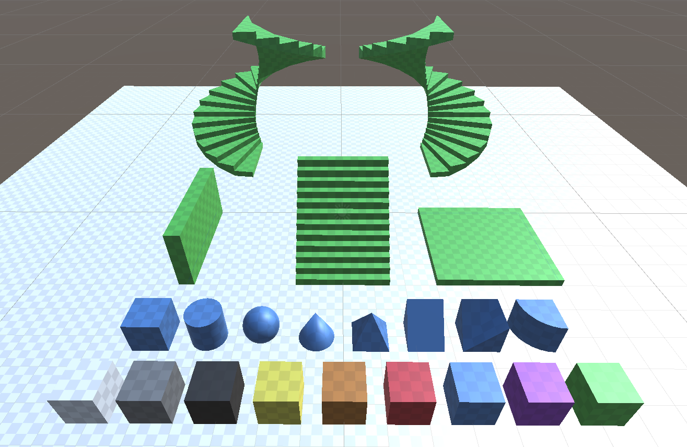
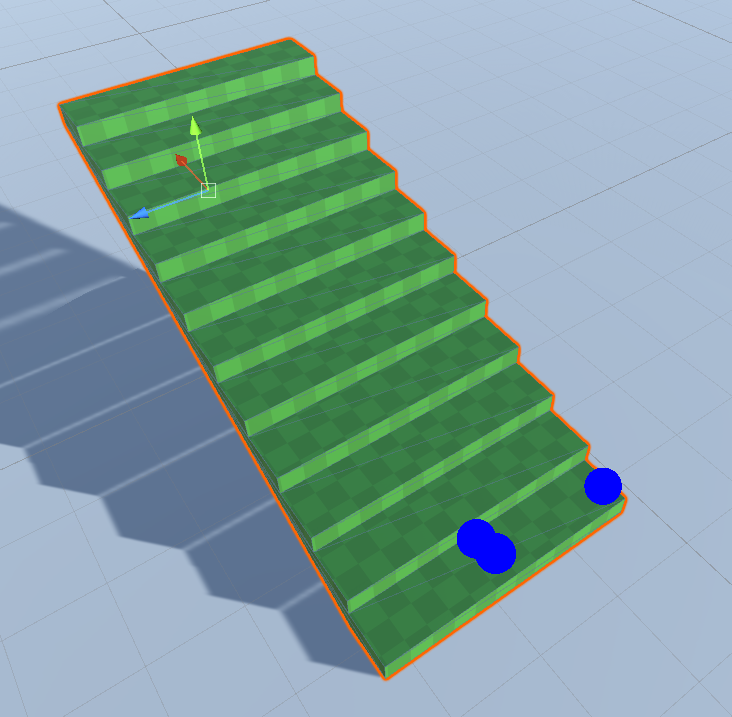
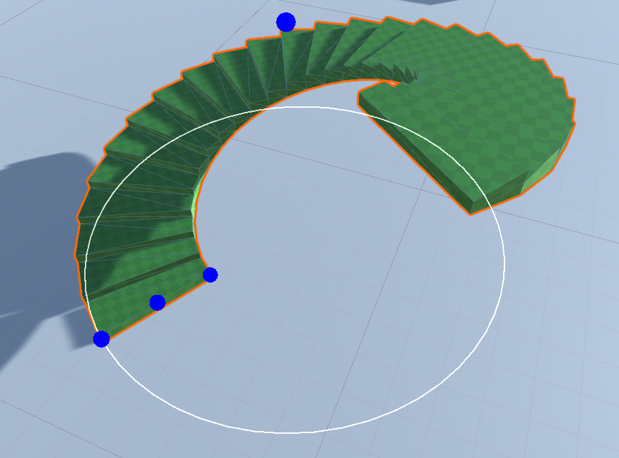
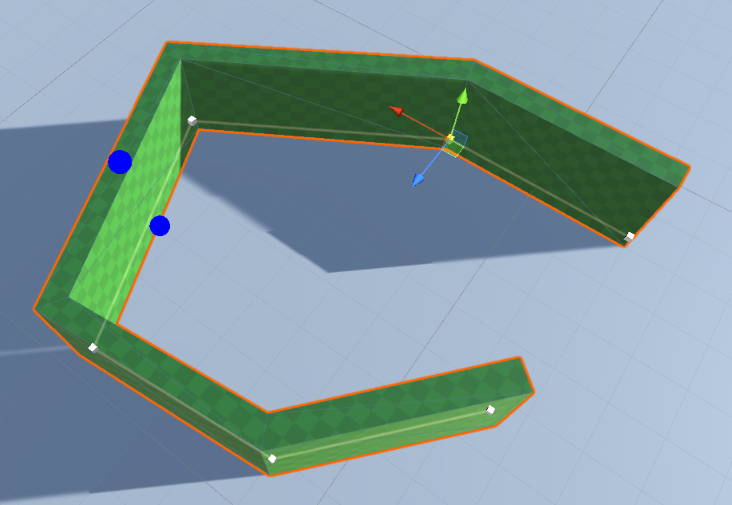
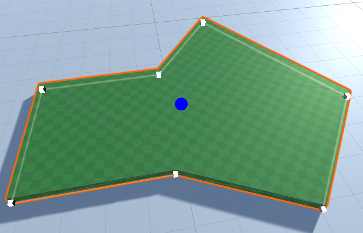
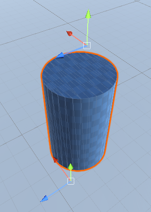
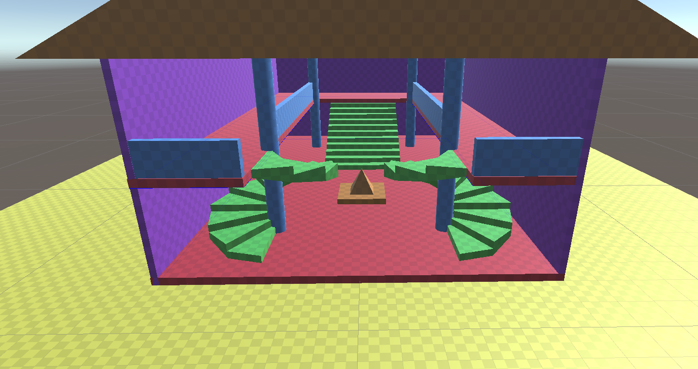

# Blockout Tools

  
A Unity editor tool for quickly creating blockouts for levels. Drag the various handles to modify the different properties (or edit them in the inspector)

## Features

### Stairs

### Spiral Stairs

### Walls

### Floors

### Primitives

### Easily create a blockout for your level

